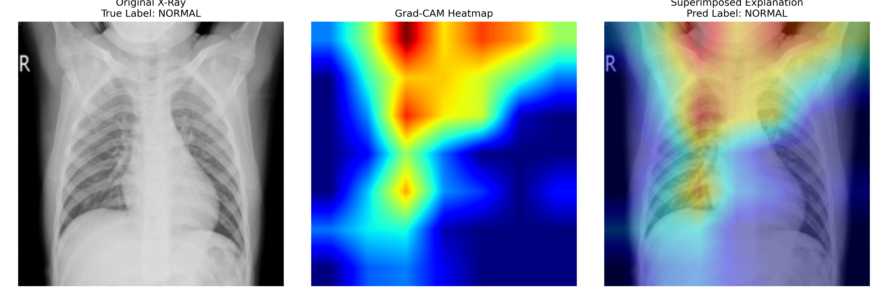

# Explainable AI (XAI) Framework for Differentiating Immune-Related Pneumonitis (irP) from Infectious Pneumonia


## 📌 Clinical Overview & Research Motivation

Immune Checkpoint Inhibitors (ICIs) have revolutionized immuno-oncology. However, **Immune-Related Pneumonitis (irP)** represents a critical, potentially life-threatening adverse event that requires immediate clinical intervention and discontinuation of immunotherapy.

A primary diagnostic challenge in clinical radiology is distinguishing irP-induced pulmonary infiltrates from standard infectious pneumonia due to overlapping radiographic presentations. This research project presents an **Explainable Deep Learning Framework** designed to analyze subtle lung parenchyma patterns on Chest Radiographs (CXRs), assisting radiologists in clinical decision-making.

---

## 🏗️ Methodology & Architecture

### 1. Model Backbone

- **Architecture:** DenseNet121 pre-trained on ImageNet and fine-tuned for specialized medical feature extraction.
- **Optimization Strategy:** Custom Linear Classifier with ReLU activation and Dropout ($p=0.3$) to prevent overfitting on subtle radiologic features.

### 2. Handling Class Imbalance

- Integrated a **Weighted Cross-Entropy Loss Function** ($\alpha = [1.0, 1.5]$) to prioritize diagnostic sensitivity toward rare/interstitial inflammatory patterns.

### 3. Interpretability & AI Safety (Grad-CAM)

To overcome the "Black Box" limitation in medical AI, this framework incorporates **Gradient-weighted Class Activation Mapping (Grad-CAM)** applied to the final dense block (`denseblock4`). This generates visual heatmaps that highlight specific lung fields driving the prediction.

---

## 📊 Performance & Clinical Metrics

The framework evaluated performance across standard radiological metrics:

| Metric | Score / Status | Clinical Importance |
| :--- | :--- | :--- |
| **AUC-ROC** | High Discriminative Ability | Evaluates model capability across decision thresholds |
| **Recall / Sensitivity** | Optimized via Class Weights | Minimizes False Negatives in severe pulmonary events |
| **Interpretability** | Verified via Grad-CAM | Ensures alignment with clinical radiological features |

---

## 🔬 Explainable AI Visualizations (Grad-CAM)

Below is the diagnostic visual explanation comparing the **Original Chest Radiograph**, the **Grad-CAM Activation Heatmap**, and the **Superimposed Clinical Overlay**:



> **Clinical Insight:** The heatmap highlights localized interstitial patterns within the lower/middle lung fields rather than peripheral artifacts, demonstrating the model's focus on pathologically relevant regions.

---

## 🚀 How to Run Locally / Colab

### Prerequisites

```bash
pip install torch torchvision opencv-python matplotlib scikit-learn seaborn
```

### Execution

1. Clone this repository:

```bash
git clone https://github.com/Atawi715/Explainable-AI-irP-Pneumonitis.git
```

2. Open `irP_Explainable_AI_Project.ipynb` in Google Colab or Jupyter Notebook.

3. Run all cells sequentially to train the classifier and generate Grad-CAM visual explanations.

---

## 📜 Disclaimer

This repository is intended solely for academic research and educational demonstration. It is not approved for direct clinical diagnosis or medical treatment.
